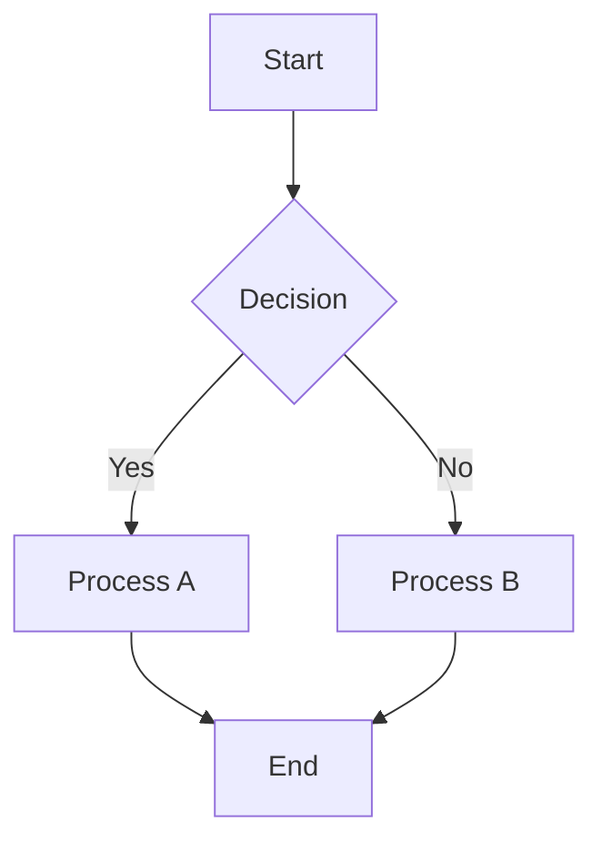

# Markdown Editor

A feature-rich, browser-based Markdown editor with real-time preview, Mermaid diagram support, and customizable themes.

## ✨ Features

- **Real-time Preview**: See your Markdown rendered instantly as you type
- **Split View**: Resizable editor and preview panels
- **Mermaid Diagrams**: Full support for flowcharts, sequence diagrams, class diagrams, pie charts, and more
- **Diagram Export**: Download Mermaid diagrams as PNG or SVG
- **Math Equations**: LaTeX/TeX math rendering with KaTeX
  - Inline math: `$E=mc^2$`
  - Block math: `$$\int_{-\infty}^{\infty} e^{-x^2} dx = \sqrt{\pi}$$`
  - Export equations as PNG or SVG
- **Syntax Highlighting**: Code blocks with automatic language detection
- **File Operations**: Open, save, and create Markdown files
- **Theme Support**: 
  - Light/Dark mode toggle
  - 8 customizable accent color themes (Indigo, Blue, Cyan, Emerald, Amber, Rose, Violet, Slate)
- **Sample Code Templates**: Quick insertion of Mermaid diagrams and math formulas
  - 10 Mermaid diagram types (Flowchart, Sequence, Class, State, ER, Gantt, Pie, Git Graph, Mindmap, Timeline)
  - 12 Math formula templates (fractions, integrals, matrices, and more)
- **Print Support**: Print preview content with optimized styling
- **Persistent Settings**: Theme preferences saved to localStorage
- **Keyboard Shortcuts**:
  - `Ctrl/Cmd + S`: Save file
  - `Ctrl/Cmd + O`: Open file
  - `Ctrl/Cmd + Z`: Undo
  - `Ctrl/Cmd + Y`: Redo (or `Ctrl/Cmd + Shift + Z`)
  - `Tab`: Insert spaces (configurable: 2/4/8)
  - `Shift+Tab`: Remove indent
  - `Enter`: Auto-indent (preserves current line's indentation)

## 🚀 Getting Started

### Option 1: Direct Use
Simply download `markdown-editor.html` and open it in your web browser. No installation or server required!

or

Visit the [GitHub Pages version](https://ta-plug.github.io/markdown_editor_with_mermaid/markdown-editor.html)


### Option 2: Clone Repository
```bash
git clone https://github.com/yourusername/markdown-editor-pro.git
cd markdown-editor-pro
# Open markdown-editor.html in your browser
```

## 📖 Usage

### Basic Editing
1. Type Markdown in the left panel
2. See the rendered preview in the right panel
3. Drag the center divider to resize panels

### Working with Files
- **New File**: File menu → New
- **Open File**: File menu → Open (supports .md, .txt files)
- **Save**: File menu → Save (overwrites current file)
- **Save As**: File menu → Save As (specify new filename)

### Mermaid Diagrams
Create diagrams using fenced code blocks with the `mermaid` language identifier:

````markdown

````

Hover over any rendered diagram to reveal PNG/SVG download buttons.

### Math Equations
Write mathematical expressions using LaTeX syntax:

```markdown
Inline math: $E=mc^2$

Block math:
$$
\frac{-b \pm \sqrt{b^2-4ac}}{2a}
$$
```

Hover over block equations to download them as PNG or SVG.

### Customizing Appearance
- **Theme Toggle**: Click the sun/moon icon (top right) to switch between light and dark modes
- **Color Theme**: Click the palette icon to choose from 8 accent colors

## ⚠️ Security Notice

This editor is designed for **local, client-side use only**. Please be aware of the following:

- **XSS Risk**: The Markdown parser (Marked.js) does not sanitize HTML output. While this is generally safe for personal use, avoid opening Markdown files from untrusted sources.
- **Not for Server Use**: Do not use this editor in server-side applications or multi-user environments without adding proper HTML sanitization (e.g., DOMPurify).
- **Local Storage**: Theme preferences are stored in your browser's localStorage.

### For Enhanced Security
If you plan to use this editor with untrusted content, consider adding [DOMPurify](https://github.com/cure53/DOMPurify) to sanitize the HTML output.

## 🛠️ Technologies Used

- [Marked.js](https://marked.js.org/) - Markdown parser
- [Highlight.js](https://highlightjs.org/) - Syntax highlighting
- [Mermaid.js](https://mermaid.js.org/) - Diagram generation
- [KaTeX](https://katex.org/) - Math equation rendering
- [html2canvas](https://html2canvas.hertzen.com/) - PNG export functionality
- [Google Fonts](https://fonts.google.com/) - JetBrains Mono & Noto Sans JP

## 📄 License

This project is licensed under the MIT License - see the [LICENSE.md](LICENSE.md) file for details.

For third-party library licenses, see [THIRD_PARTY_LICENSES.md](THIRD_PARTY_LICENSES.md).

## 🤝 Contributing

Contributions are welcome! Please feel free to submit a Pull Request.

1. Fork the repository
2. Create your feature branch (`git checkout -b feature/AmazingFeature`)
3. Commit your changes (`git commit -m 'Add some AmazingFeature'`)
4. Push to the branch (`git push origin feature/AmazingFeature`)
5. Open a Pull Request

## 📝 Changelog

### v1.2.3
- Performance: KaTeX math equation caching (unchanged equations skip re-rendering)

### v1.2.2
- Fix: Preview scroll position now preserved during editing
- Fix: Undo now works correctly after sample code insertion
- Performance: Mermaid diagram caching (unchanged diagrams skip re-rendering)

### v1.2.1
- Unlimited Undo/Redo functionality
- Keyboard shortcuts: Ctrl+Z (Undo), Ctrl+Y or Ctrl+Shift+Z (Redo)
- Undo/Redo toolbar buttons with visual feedback

### v1.2.0
- Sample code insertion feature with modal dialog
- 10 Mermaid diagram templates with live preview
- 12 Math formula templates with rendered preview
- Tabbed interface for easy navigation between diagram and formula samples

### v1.1.1
- Smart indent: Auto-preserve indentation on Enter
- Tab/Shift+Tab indent/outdent for single and multiple lines
- Configurable indent size (2/4/8 spaces) with persistent setting

### v1.1.0
- Math equation support with KaTeX (inline and block)
- Math equation export as PNG/SVG
- Equation counter in status bar

### v1.0.1
- Multilingual support (English, Chinese, Japanese)

### v1.0.0
- Initial release
- Real-time Markdown preview
- Mermaid diagram support with PNG/SVG export
- Light/Dark mode with 8 color themes
- File open/save functionality
- Print support

## 🙏 Acknowledgments

- Inspired by various Markdown editors in the open-source community
- Thanks to all the maintainers of the libraries used in this project
